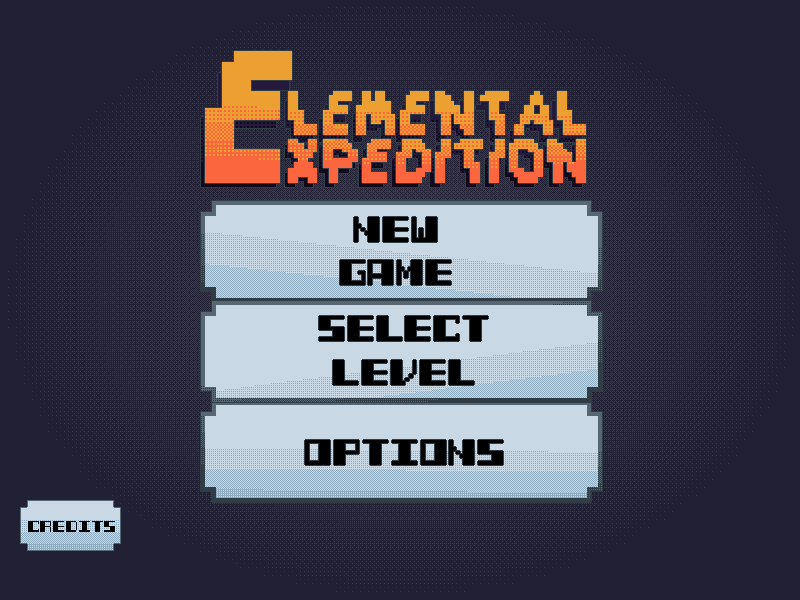
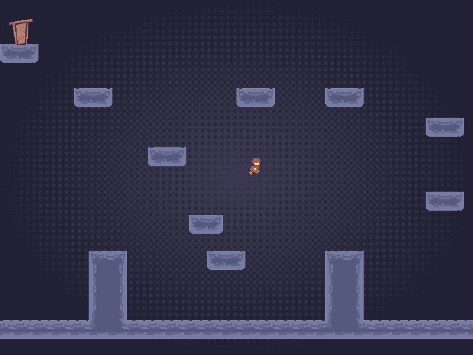
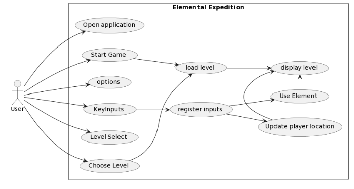
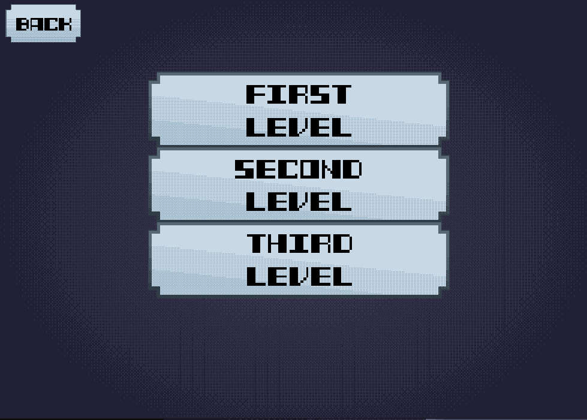
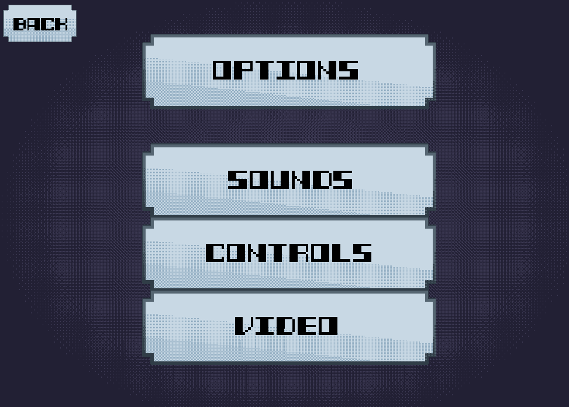
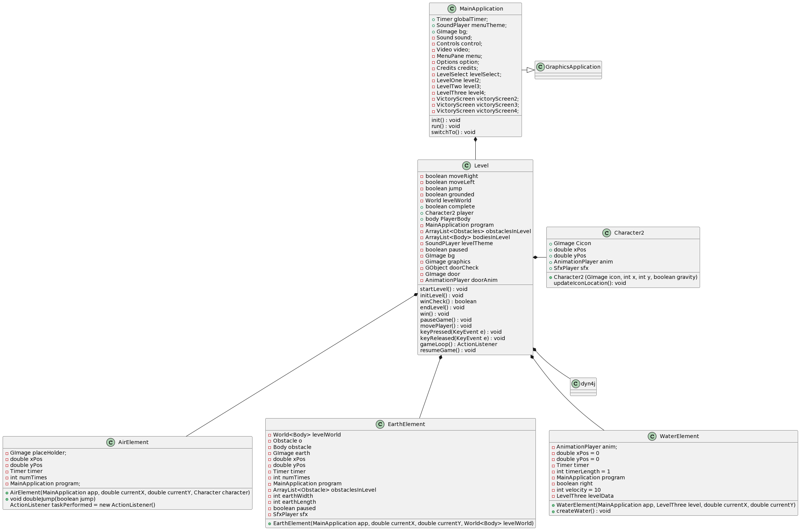
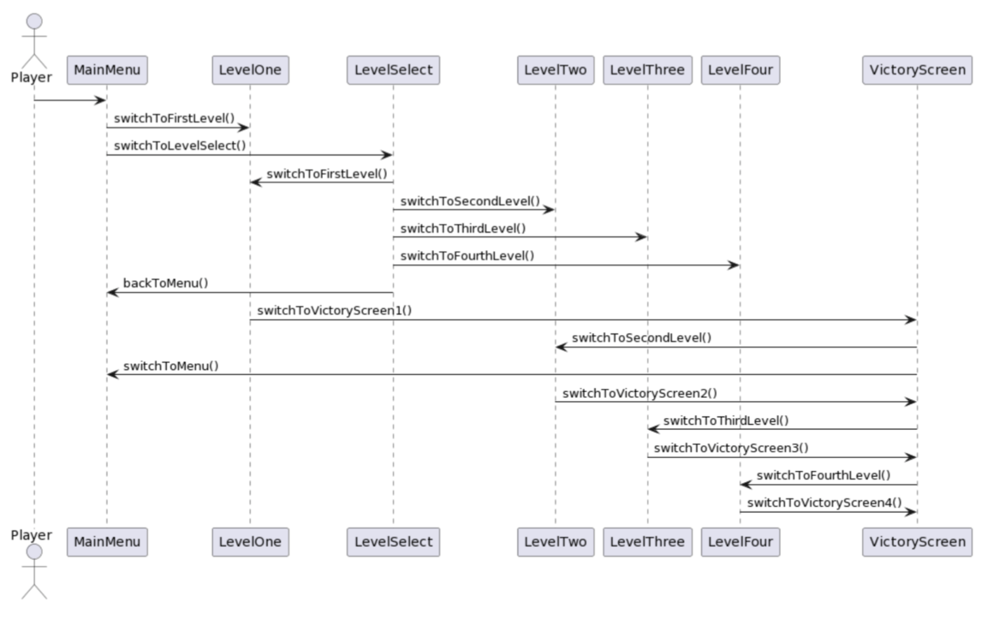

# Elemental Expedition

<h1> Requirements Statement </h1>
Our video game Elemental Expedition is here to provide an entertaining experience for anyone who might be on the hunt for a fun and challenging 2D platformer. Whether it be to simply kill time or test your own skills in an enjoyable atmosphere, this game was created with the open intent of letting anyone and everyone unwind, enjoy themselves, and play. The game is reminiscent of those within the same genre, such as "Fireboy & Watergirl" or "Super Mario Bros." You'll be controlling the player character as you jump from platform to platform, all the while using elemental abilities that can assist you in discovering ways to complete each level. The true challenge for players comes from having to balance both your wits and your skills to accomplish that task and make perfect use of the elements at your disposal. Elemental Expedition was built in Java and makes use of a pixel art aesthetic that matches perfectly with the original soundtrack that our team made for each and every level.

  

The main menu screen of the game!

Gameplay from level two!

## Use Case Diagram 

This screenshot below from the game demonstrates that we implemented the Key inputs use case. 
Screenshot from Level 3 

This screenshot below from the game demonstrates that we implemented the menu, options, and level select use cases. 

Currently, there are 3 levels in the game, with one level each featuring air, earth, or water. A fourth level featuring the fire element has not yet been implemented. 
## UML Class Diagram 

## Interaction Diagram

The patterns used in this design are typical to a normal platformer. All games start at the main menu, as this is the point where you can go between all points of the game.
From there, the player can go to the level select, setting, and the credits of the game. Having a button to start the game is also very normal for games that are level based, as it makes playing the game quickly accessible, and not as much of a hassle. Having a level select is also nothing out of the ordinary to a level based game, as being able to select any individual level is important so that there is a quicker easier way to get to a level of choice, instead of needing to complete each level in order. Lastly, sending the player to the victory screen once they touch the door (and press spacebar to enter) is also justifiable, since going to the next level or to the main menu will always be the next step after completing a level.

## How to play the game 
Run MainApplication.java to open the game window. Then, click either Start Game to start at level 1 or go through the level select menu to choose a different level. Once inside of a level, use the arrow keys to navigate through the puzzle. The down arrow key has been reserved to execute the element. (Note: Air Element features a double jump, which can be activated by clicking the up arrow key twice). 

## References
* We took inspiration from the game series "Fireboy and Watergirl", which are games where two players will control the characters Fireboy and Watergirl to use their perspective abilities to solve puzzles in many unique levels. [Play the game here](https://www.coolmathgames.com/0-fireboy-and-water-girl-in-the-forest-temple)
* We used the ACM library to render our character/avatar and other objects in our level, while it can't be used to do anything else really, it is relatively easy to use and really helpful for us. [Link](https://cs.stanford.edu/people/eroberts/jtf/javadoc/student/)
* We also used the dyn4j library/physics engine to apply collision physics to all the objects we placed in the levels. We couldn't figure out how to reliably implement a consistent physics presence in our game, and we had to resort to finding a new library that allows easy implementation of physics to objects in the game, and we found dyn4j. [Link](https://dyn4j.org)
